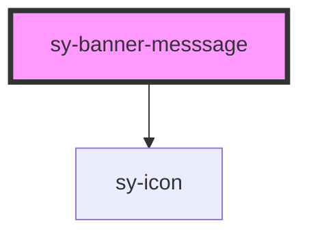

# sy-banner-messsage

<!-- Auto Generated Below -->

## Properties

| Property      | Attribute      | Description | Type                                                       | Default  |
| ------------- | -------------- | ----------- | ---------------------------------------------------------- | -------- |
| `closable`    | `closable`     |             | `boolean`                                                  | `false`  |
| `header`      | `header`       |             | `string`                                                   | `''`     |
| `message`     | `message`      |             | `string`                                                   | `''`     |
| `neutralIcon` | `neutral-icon` |             | `string`                                                   | `''`     |
| `showIcon`    | `showicon`     |             | `boolean`                                                  | `false`  |
| `variant`     | `variant`      |             | `"error" \| "info" \| "neutral" \| "success" \| "warning"` | `'info'` |

## Dependencies

### Depends on

- [sy-icon](../icon)

### Graph

----------------------------------------------

*Built with [StencilJS](https://stenciljs.com/)*
