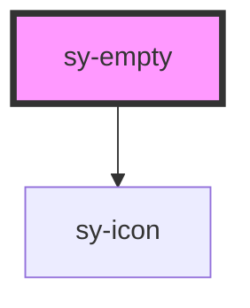

# sy-empty

<!-- Auto Generated Below -->

## Properties

| Property      | Attribute     | Description                     | Type     | Default     |
| ------------- | ------------- | ------------------------------- | -------- | ----------- |
| `description` | `description` | Empty 컴포넌트에 표시될 설명 텍스트입니다. Lit의 | `string` | `undefined` |

## Dependencies

### Depends on

- [sy-icon](../icon)

### Graph

----------------------------------------------

*Built with [StencilJS](https://stenciljs.com/)*
