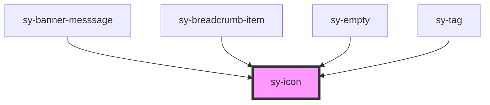

# sy-icon

<!-- Auto Generated Below -->

## Properties

| Property     | Attribute    | Description | Type                                                                                             | Default     |
| ------------ | ------------ | ----------- | ------------------------------------------------------------------------------------------------ | ----------- |
| `path`       | `path`       |             | `string`                                                                                         | `undefined` |
| `selectable` | `selectable` |             | `boolean`                                                                                        | `false`     |
| `size`       | `size`       |             | `"large" \| "medium" \| "small" \| "xlarge" \| "xsmall" \| "xxlarge" \| "xxsmall" \| "xxxlarge"` | `'medium'`  |

## Events

| Event      | Description | Type                              |
| ---------- | ----------- | --------------------------------- |
| `selected` |             | `CustomEvent<{ value: string; }>` |

## Dependencies

### Used by

 - [sy-banner-messsage](../banner)
 - [sy-breadcrumb-item](../breadcrumb)
 - [sy-empty](../empty)
 - [sy-tag](../tag)

### Graph

----------------------------------------------

*Built with [StencilJS](https://stenciljs.com/)*
