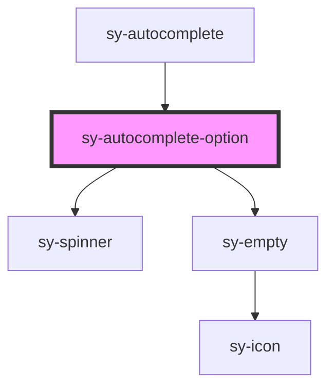

# sy-autocomplete-option

<!-- Auto Generated Below -->

## Properties

| Property      | Attribute      | Description | Type       | Default |
| ------------- | -------------- | ----------- | ---------- | ------- |
| `activeIndex` | `active-index` |             | `number`   | `-1`    |
| `loading`     | `loading`      |             | `boolean`  | `false` |
| `source`      | --             |             | `string[]` | `[]`    |

## Events

| Event           | Description | Type                  |
| --------------- | ----------- | --------------------- |
| `activeChanged` |             | `CustomEvent<number>` |
| `selected`      |             | `CustomEvent<string>` |

## Methods

### `setEvent(index: number) => Promise<void>`

#### Parameters

| Name    | Type     | Description |
| ------- | -------- | ----------- |
| `index` | `number` |             |

#### Returns

Type: `Promise<void>`

## Dependencies

### Used by

 - [sy-autocomplete](.)

### Depends on

- [sy-spinner](../spinner)
- [sy-empty](../empty)

### Graph

----------------------------------------------

*Built with [StencilJS](https://stenciljs.com/)*
