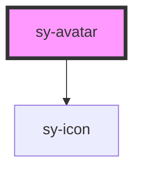

# sy-avatar

<!-- Auto Generated Below -->

## Properties

| Property         | Attribute        | Description | Type                                                                                                                           | Default       |
| ---------------- | ---------------- | ----------- | ------------------------------------------------------------------------------------------------------------------------------ | ------------- |
| `clickable`      | `clickable`      |             | `boolean`                                                                                                                      | `false`       |
| `disabled`       | `disabled`       |             | `boolean`                                                                                                                      | `false`       |
| `icon`           | `icon`           |             | `string`                                                                                                                       | `''`          |
| `image`          | `image`          |             | `string`                                                                                                                       | `''`          |
| `letter`         | `letter`         |             | `string`                                                                                                                       | `''`          |
| `size`           | `size`           |             | `"large" \| "medium" \| "small"`                                                                                               | `'medium'`    |
| `text`           | `text`           |             | `string`                                                                                                                       | `''`          |
| `tooltipContent` | `tooltipcontent` |             | `string`                                                                                                                       | `''`          |
| `variant`        | `variant`        |             | `"blue" \| "darkgray" \| "green" \| "lightgray" \| "lime" \| "magenta" \| "orange" \| "purple" \| "red" \| "teal" \| "yellow"` | `"lightgray"` |

## Events

| Event           | Description | Type                                                                          |
| --------------- | ----------- | ----------------------------------------------------------------------------- |
| `disableStatus` |             | `CustomEvent<{ disabled: boolean; }>`                                         |
| `selected`      |             | `CustomEvent<{ letter: string; text: string; icon: string; image: string; }>` |

## Dependencies

### Depends on

- [sy-icon](../icon)

### Graph

----------------------------------------------

*Built with [StencilJS](https://stenciljs.com/)*
