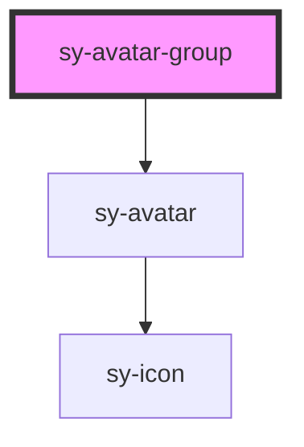

# sy-avatar

<!-- Auto Generated Below -->

## Overview

sy-avatar-group (Stencil port, light DOM, scoped)
- Renders slotted <sy-avatar> children
- If children count > maxCount, shows +N and a dropdown list appended to body

## Properties

| Property    | Attribute   | Description | Type                             | Default           |
| ----------- | ----------- | ----------- | -------------------------------- | ----------------- |
| `clickable` | `clickable` |             | `boolean`                        | `false`           |
| `maxCount`  | `maxcount`  |             | `number`                         | `Infinity as any` |
| `size`      | `size`      |             | `"large" \| "medium" \| "small"` | `'medium'`        |
| `variant`   | `variant`   |             | `"grid" \| "stack"`              | `'stack'`         |

## Dependencies

### Depends on

- [sy-avatar](.)

### Graph

----------------------------------------------

*Built with [StencilJS](https://stenciljs.com/)*
