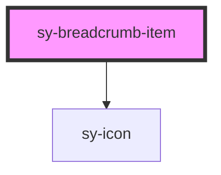

# sy-breadcrumb-item

<!-- Auto Generated Below -->

## Properties

| Property          | Attribute         | Description | Type                 | Default     |
| ----------------- | ----------------- | ----------- | -------------------- | ----------- |
| `active`          | `active`          |             | `boolean`            | `false`     |
| `disabled`        | `disabled`        |             | `boolean`            | `false`     |
| `isLast`          | `is-last`         |             | `boolean`            | `false`     |
| `parentSeparator` | `parentseparator` |             | `"arrow" \| "slash"` | `'slash'`   |
| `separator`       | `separator`       |             | `"arrow" \| "slash"` | `undefined` |

## Events

| Event      | Description | Type                                       |
| ---------- | ----------- | ------------------------------------------ |
| `selected` |             | `CustomEvent<HTMLSyBreadcrumbItemElement>` |

## Methods

### `forceUpdate() => Promise<void>`

#### Returns

Type: `Promise<void>`

## Dependencies

### Depends on

- [sy-icon](../icon)

### Graph

----------------------------------------------

*Built with [StencilJS](https://stenciljs.com/)*
