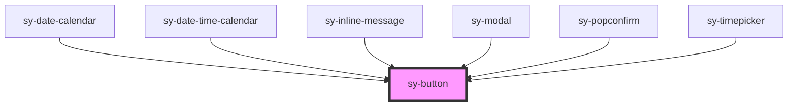

# sy-button

<!-- Auto Generated Below -->

## Properties

| Property         | Attribute        | Description | Type                                                    | Default     |
| ---------------- | ---------------- | ----------- | ------------------------------------------------------- | ----------- |
| `disabled`       | `disabled`       |             | `boolean`                                               | `false`     |
| `formnovalidate` | `formnovalidate` |             | `boolean`                                               | `false`     |
| `justified`      | `justified`      |             | `boolean`                                               | `false`     |
| `loading`        | `loading`        |             | `boolean`                                               | `false`     |
| `size`           | `size`           |             | `"large" \| "medium" \| "small"`                        | `'medium'`  |
| `type`           | `type`           |             | `"button" \| "reset" \| "submit"`                       | `'button'`  |
| `variant`        | `variant`        |             | `"borderless" \| "default" \| "primary" \| "secondary"` | `'default'` |

## Methods

### `setBlur() => Promise<void>`

#### Returns

Type: `Promise<void>`

### `setButtonGroupState(state: ButtonGroupState) => Promise<void>`

#### Parameters

| Name    | Type               | Description |
| ------- | ------------------ | ----------- |
| `state` | `ButtonGroupState` |             |

#### Returns

Type: `Promise<void>`

### `setClick() => Promise<void>`

#### Returns

Type: `Promise<void>`

### `setFocus() => Promise<void>`

#### Returns

Type: `Promise<void>`

## Dependencies

### Used by

 - [sy-date-calendar](../datepicker)
 - [sy-date-time-calendar](../datepicker)
 - [sy-inline-message](../inline-message)
 - [sy-modal](../modal)
 - [sy-popconfirm](../popconfirm)
 - [sy-timepicker](../datepicker)

### Graph

----------------------------------------------

*Built with [StencilJS](https://stenciljs.com/)*
