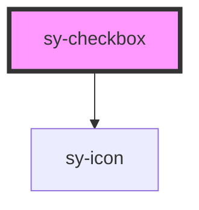

# sy-checkbox

<!-- Auto Generated Below -->

## Properties

| Property        | Attribute       | Description | Type      | Default |
| --------------- | --------------- | ----------- | --------- | ------- |
| `checked`       | `checked`       |             | `boolean` | `false` |
| `disabled`      | `disabled`      |             | `boolean` | `false` |
| `indeterminate` | `indeterminate` |             | `boolean` | `false` |
| `readonly`      | `readonly`      |             | `boolean` | `false` |
| `required`      | `required`      |             | `boolean` | `false` |

## Events

| Event     | Description | Type                                                                                           |
| --------- | ----------- | ---------------------------------------------------------------------------------------------- |
| `blured`  |             | `CustomEvent<{ value: boolean; isValid: boolean; checked: boolean; indeterminate: boolean; }>` |
| `changed` |             | `CustomEvent<{ value: boolean; isValid: boolean; checked: boolean; indeterminate: boolean; }>` |
| `focused` |             | `CustomEvent<{ value: boolean; isValid: boolean; checked: boolean; indeterminate: boolean; }>` |

## Methods

### `checkValidity() => Promise<boolean>`

#### Returns

Type: `Promise<boolean>`

### `clearCustomError() => Promise<void>`

#### Returns

Type: `Promise<void>`

### `reportValidity() => Promise<boolean>`

#### Returns

Type: `Promise<boolean>`

### `setBlur() => Promise<void>`

#### Returns

Type: `Promise<void>`

### `setCustomError() => Promise<void>`

#### Returns

Type: `Promise<void>`

### `setFocus() => Promise<void>`

#### Returns

Type: `Promise<void>`

## Dependencies

### Depends on

- [sy-icon](../icon)

### Graph

----------------------------------------------

*Built with [StencilJS](https://stenciljs.com/)*
