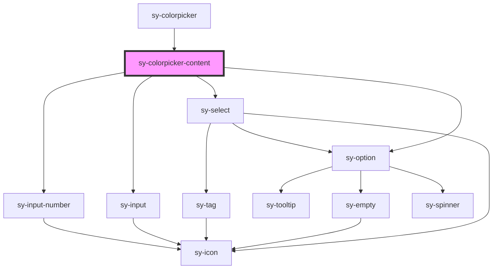

# sy-colorpicker-content

<!-- Auto Generated Below -->

## Properties

| Property      | Attribute     | Description | Type                      | Default     |
| ------------- | ------------- | ----------- | ------------------------- | ----------- |
| `disabled`    | `disabled`    |             | `boolean`                 | `false`     |
| `format`      | `format`      |             | `"hex" \| "hsb" \| "rgb"` | `'hex'`     |
| `hideOpacity` | `hodeopacity` |             | `boolean`                 | `false`     |
| `opacity`     | `opacity`     |             | `number`                  | `1`         |
| `readonly`    | `readonly`    |             | `boolean`                 | `false`     |
| `value`       | `value`       |             | `string`                  | `'#ff0000'` |

## Events

| Event         | Description | Type                                                               |
| ------------- | ----------- | ------------------------------------------------------------------ |
| `colorChange` |             | `CustomEvent<{ value: string; opacity: number; format: string; }>` |

## Dependencies

### Used by

 - [sy-colorpicker](.)

### Depends on

- [sy-select](../select)
- [sy-option](../select)
- [sy-input](../input)
- [sy-input-number](../input-number)

### Graph

----------------------------------------------

*Built with [StencilJS](https://stenciljs.com/)*
