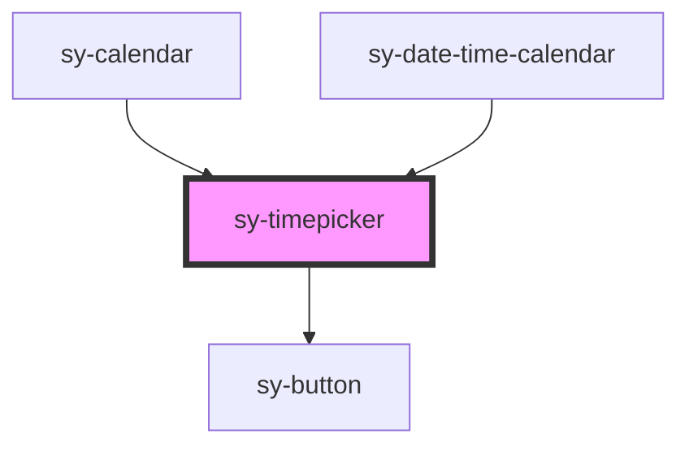

# sy-timepicker

<!-- Auto Generated Below -->

## Properties

| Property        | Attribute       | Description | Type      | Default      |
| --------------- | --------------- | ----------- | --------- | ------------ |
| `format`        | `format`        |             | `string`  | `'hh:mm:ss'` |
| `hideButton`    | `hidebutton`    |             | `boolean` | `false`      |
| `hour`          | `hour`          |             | `number`  | `0`          |
| `minute`        | `minute`        |             | `number`  | `0`          |
| `second`        | `second`        |             | `number`  | `0`          |
| `timeSeparator` | `timeseparator` |             | `string`  | `':'`        |

## Events

| Event      | Description | Type               |
| ---------- | ----------- | ------------------ |
| `changed`  |             | `CustomEvent<any>` |
| `selected` |             | `CustomEvent<any>` |

## Dependencies

### Used by

 - [sy-calendar](.)
 - [sy-date-time-calendar](.)

### Depends on

- [sy-button](../button)

### Graph

----------------------------------------------

*Built with [StencilJS](https://stenciljs.com/)*
