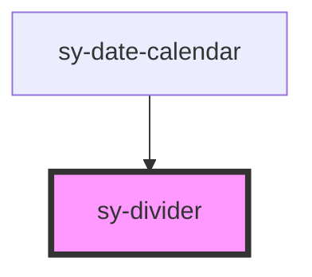

# sy-divider

<!-- Auto Generated Below -->

## Properties

| Property | Attribute | Description | Type                         | Default        |
| -------- | --------- | ----------- | ---------------------------- | -------------- |
| `type`   | `type`    |             | `"horizontal" \| "vertical"` | `'horizontal'` |

## Dependencies

### Used by

 - [sy-date-calendar](../datepicker)

### Graph

----------------------------------------------

*Built with [StencilJS](https://stenciljs.com/)*
