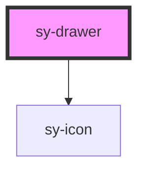

# sy-drawer

<!-- Auto Generated Below -->

## Properties

| Property       | Attribute       | Description | Type                                         | Default    |
| -------------- | --------------- | ----------- | -------------------------------------------- | ---------- |
| `closable`     | `closable`      |             | `boolean`                                    | `false`    |
| `customSize`   | `custom-size`   |             | `number`                                     | `100`      |
| `maskless`     | `maskless`      |             | `boolean`                                    | `false`    |
| `open`         | `open`          |             | `boolean`                                    | `false`    |
| `position`     | `position`      |             | `"bottom" \| "left" \| "right" \| "top"`     | `'right'`  |
| `preventClose` | `prevent-close` |             | `boolean`                                    | `false`    |
| `size`         | `size`          |             | `"custom" \| "large" \| "medium" \| "small"` | `'medium'` |

## Events

| Event    | Description | Type                |
| -------- | ----------- | ------------------- |
| `closed` |             | `CustomEvent<void>` |
| `opened` |             | `CustomEvent<void>` |

## Dependencies

### Depends on

- [sy-icon](../icon)

### Graph

----------------------------------------------

*Built with [StencilJS](https://stenciljs.com/)*
