# sy-icon

<!-- Auto Generated Below -->

## Properties

| Property     | Attribute    | Description | Type                                                                                             | Default     |
| ------------ | ------------ | ----------- | ------------------------------------------------------------------------------------------------ | ----------- |
| `path`       | `path`       |             | `string`                                                                                         | `undefined` |
| `selectable` | `selectable` |             | `boolean`                                                                                        | `false`     |
| `size`       | `size`       |             | `"large" \| "medium" \| "small" \| "xlarge" \| "xsmall" \| "xxlarge" \| "xxsmall" \| "xxxlarge"` | `'medium'`  |

## Events

| Event      | Description | Type                              |
| ---------- | ----------- | --------------------------------- |
| `selected` |             | `CustomEvent<{ value: string; }>` |

## Dependencies

### Used by

 - [sy-avatar](../avatar)
 - [sy-banner-messsage](../banner)
 - [sy-breadcrumb-item](../breadcrumb)
 - [sy-checkbox](../checkbox)
 - [sy-date-calendar](../datepicker)
 - [sy-datepicker](../datepicker)
 - [sy-drawer](../drawer)
 - [sy-empty](../empty)
 - [sy-inline-message](../inline-message)
 - [sy-input](../input)
 - [sy-input-number](../input-number)
 - [sy-menu-sub](../menu)
 - [sy-modal](../modal)
 - [sy-modeless](../modeless)
 - [sy-nav-sub](../nav)
 - [sy-pagination](../pagination)
 - [sy-select](../select)
 - [sy-tag](../tag)
 - [sy-textarea](../textarea)
 - [sy-toast-item](../toast)

### Graph

```mermaid
graph TD;
  sy-avatar --> sy-icon
  sy-banner-messsage --> sy-icon
  sy-breadcrumb-item --> sy-icon
  sy-checkbox --> sy-icon
  sy-date-calendar --> sy-icon
  sy-datepicker --> sy-icon
  sy-drawer --> sy-icon
  sy-empty --> sy-icon
  sy-inline-message --> sy-icon
  sy-input --> sy-icon
  sy-input-number --> sy-icon
  sy-menu-sub --> sy-icon
  sy-modal --> sy-icon
  sy-modeless --> sy-icon
  sy-nav-sub --> sy-icon
  sy-pagination --> sy-icon
  sy-select --> sy-icon
  sy-tag --> sy-icon
  sy-textarea --> sy-icon
  sy-toast-item --> sy-icon
  style sy-icon fill:#f9f,stroke:#333,stroke-width:4px
```

----------------------------------------------

*Built with [StencilJS](https://stenciljs.com/)*
