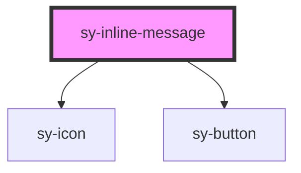

# sy-inline-message

<!-- Auto Generated Below -->

## Properties

| Property   | Attribute  | Description | Type                                          | Default    |
| ---------- | ---------- | ----------- | --------------------------------------------- | ---------- |
| `btnLabel` | `btnlabel` |             | `string`                                      | `''`       |
| `message`  | `message`  |             | `string`                                      | `''`       |
| `open`     | `open`     |             | `boolean`                                     | `false`    |
| `position` | `position` |             | `"bottom" \| "left" \| "right" \| "top"`      | `'bottom'` |
| `showIcon` | `showicon` |             | `boolean`                                     | `false`    |
| `sticky`   | `sticky`   |             | `boolean`                                     | `false`    |
| `trigger`  | `trigger`  |             | `"click" \| "focusout"`                       | `'click'`  |
| `variant`  | `variant`  |             | `"error" \| "info" \| "success" \| "warning"` | `'info'`   |

## Events

| Event      | Description | Type                      |
| ---------- | ----------- | ------------------------- |
| `btnClick` |             | `CustomEvent<MouseEvent>` |

## Dependencies

### Depends on

- [sy-icon](../icon)
- [sy-button](../button)

### Graph

----------------------------------------------

*Built with [StencilJS](https://stenciljs.com/)*
