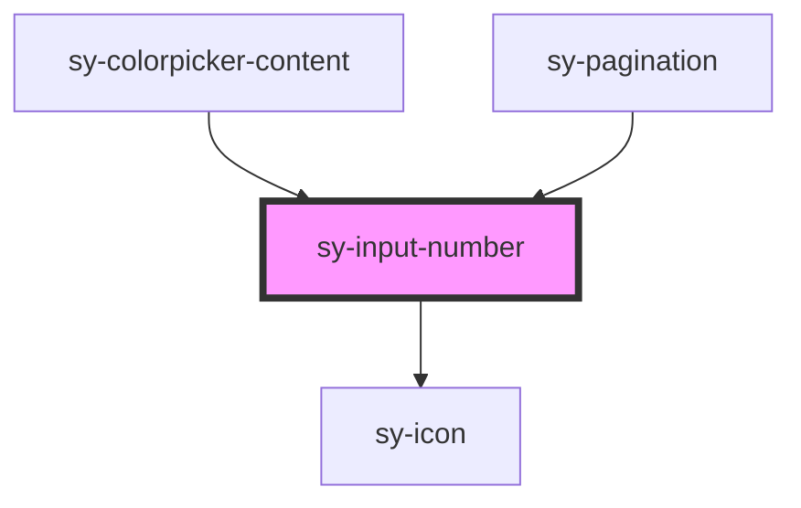

# sy-input-number

<!-- Auto Generated Below -->

## Properties

| Property           | Attribute          | Description | Type                                             | Default                   |
| ------------------ | ------------------ | ----------- | ------------------------------------------------ | ------------------------- |
| `autofocus`        | `autofocus`        |             | `boolean`                                        | `false`                   |
| `borderless`       | `borderless`       |             | `boolean`                                        | `false`                   |
| `decimalPlaces`    | `decimal-places`   |             | `number`                                         | `undefined`               |
| `disabled`         | `disabled`         |             | `boolean`                                        | `false`                   |
| `label`            | `label`            |             | `string`                                         | `""`                      |
| `max`              | `max`              |             | `number`                                         | `Number.MAX_SAFE_INTEGER` |
| `min`              | `min`              |             | `number`                                         | `Number.MIN_SAFE_INTEGER` |
| `name`             | `name`             |             | `string`                                         | `""`                      |
| `noNativeValidity` | `nonativevalidity` |             | `boolean`                                        | `false`                   |
| `readonly`         | `readonly`         |             | `boolean`                                        | `false`                   |
| `required`         | `required`         |             | `boolean`                                        | `false`                   |
| `rounding`         | `rounding`         |             | `"ceil" \| "floor" \| "round"`                   | `undefined`               |
| `size`             | `size`             |             | `"large" \| "medium" \| "small"`                 | `"medium"`                |
| `status`           | `status`           |             | `"default" \| "error" \| "success" \| "warning"` | `'default'`               |
| `step`             | `step`             |             | `number`                                         | `1`                       |
| `value`            | `value`            |             | `number \| string`                               | `''`                      |

## Events

| Event     | Description | Type                                                                |
| --------- | ----------- | ------------------------------------------------------------------- |
| `blured`  |             | `CustomEvent<{ value: number; isValid: boolean; status: string; }>` |
| `changed` |             | `CustomEvent<{ value: number; isValid: boolean; status: string; }>` |
| `focused` |             | `CustomEvent<{ value: number; isValid: boolean; status: string; }>` |

## Methods

### `checkValidity() => Promise<boolean>`

#### Returns

Type: `Promise<boolean>`

### `clearCustomError() => Promise<void>`

#### Returns

Type: `Promise<void>`

### `getStatus() => Promise<"" | "valueMissing" | "custom" | "rangeUnderflow" | "rangeOverflow" | "stepMismatch" | "typeMismatch">`

#### Returns

Type: `Promise<"" | "valueMissing" | "custom" | "rangeUnderflow" | "rangeOverflow" | "stepMismatch" | "typeMismatch">`

### `reportValidity() => Promise<boolean>`

#### Returns

Type: `Promise<boolean>`

### `setBlur() => Promise<void>`

#### Returns

Type: `Promise<void>`

### `setClear() => Promise<void>`

#### Returns

Type: `Promise<void>`

### `setCustomError() => Promise<void>`

#### Returns

Type: `Promise<void>`

### `setFocus() => Promise<void>`

#### Returns

Type: `Promise<void>`

### `stepDown(n?: number) => Promise<void>`

#### Parameters

| Name | Type     | Description |
| ---- | -------- | ----------- |
| `n`  | `number` |             |

#### Returns

Type: `Promise<void>`

### `stepUp(n?: number) => Promise<void>`

#### Parameters

| Name | Type     | Description |
| ---- | -------- | ----------- |
| `n`  | `number` |             |

#### Returns

Type: `Promise<void>`

## Dependencies

### Used by

 - [sy-colorpicker-content](../colorpicker)
 - [sy-pagination](../pagination)

### Depends on

- [sy-icon](../icon)

### Graph

----------------------------------------------

*Built with [StencilJS](https://stenciljs.com/)*
