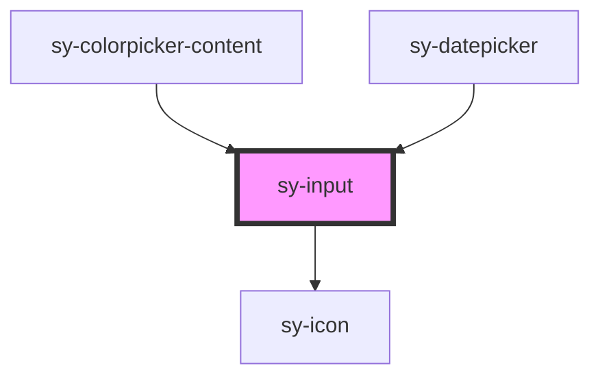

# sy-input

<!-- Auto Generated Below -->

## Properties

| Property           | Attribute          | Description | Type                                             | Default     |
| ------------------ | ------------------ | ----------- | ------------------------------------------------ | ----------- |
| `autofocus`        | `autofocus`        |             | `boolean`                                        | `false`     |
| `borderless`       | `borderless`       |             | `boolean`                                        | `false`     |
| `clearable`        | `clearable`        |             | `boolean`                                        | `false`     |
| `disabled`         | `disabled`         |             | `boolean`                                        | `false`     |
| `label`            | `label`            |             | `string`                                         | `""`        |
| `max`              | `max`              |             | `number`                                         | `undefined` |
| `min`              | `min`              |             | `number`                                         | `undefined` |
| `name`             | `name`             |             | `string`                                         | `""`        |
| `noNativeValidity` | `nonativevalidity` |             | `boolean`                                        | `false`     |
| `placeholder`      | `placeholder`      |             | `string`                                         | `""`        |
| `readonly`         | `readonly`         |             | `boolean`                                        | `false`     |
| `required`         | `required`         |             | `boolean`                                        | `false`     |
| `size`             | `size`             |             | `"large" \| "medium" \| "small"`                 | `"medium"`  |
| `status`           | `status`           |             | `"default" \| "error" \| "success" \| "warning"` | `'default'` |
| `value`            | `value`            |             | `string`                                         | `""`        |
| `variant`          | `variant`          |             | `"password" \| "search" \| "text"`               | `"text"`    |

## Events

| Event     | Description | Type                                                                |
| --------- | ----------- | ------------------------------------------------------------------- |
| `blured`  |             | `CustomEvent<{ value: string; isValid: boolean; status: string; }>` |
| `changed` |             | `CustomEvent<{ value: string; isValid: boolean; status: string; }>` |
| `focused` |             | `CustomEvent<{ value: string; isValid: boolean; status: string; }>` |

## Methods

### `checkValidity() => Promise<boolean>`

#### Returns

Type: `Promise<boolean>`

### `clearCustomError() => Promise<void>`

#### Returns

Type: `Promise<void>`

### `getStatus() => Promise<"" | "custom" | "valueMissing" | "tooShort" | "tooLong">`

#### Returns

Type: `Promise<"" | "custom" | "valueMissing" | "tooShort" | "tooLong">`

### `reportValidity() => Promise<boolean>`

#### Returns

Type: `Promise<boolean>`

### `setBlur() => Promise<void>`

#### Returns

Type: `Promise<void>`

### `setCustomError() => Promise<void>`

#### Returns

Type: `Promise<void>`

### `setFocus() => Promise<void>`

#### Returns

Type: `Promise<void>`

## Dependencies

### Used by

 - [sy-colorpicker-content](../colorpicker)
 - [sy-datepicker](../datepicker)

### Depends on

- [sy-icon](../icon)

### Graph

----------------------------------------------

*Built with [StencilJS](https://stenciljs.com/)*
