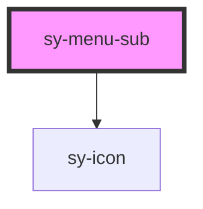

# sy-menu-sub

<!-- Auto Generated Below -->

## Properties

| Property   | Attribute  | Description | Type      | Default |
| ---------- | ---------- | ----------- | --------- | ------- |
| `disabled` | `disabled` |             | `boolean` | `false` |
| `open`     | `open`     |             | `boolean` | `false` |
| `title`    | `title`    |             | `string`  | `''`    |

## Dependencies

### Depends on

- [sy-icon](../icon)

### Graph

----------------------------------------------

*Built with [StencilJS](https://stenciljs.com/)*
