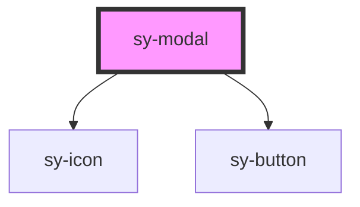

# sy-modal

<!-- Auto Generated Below -->

## Properties

| Property              | Attribute             | Description | Type                  | Default    |
| --------------------- | --------------------- | ----------- | --------------------- | ---------- |
| `cancelText`          | `canceltext`          |             | `string`              | `''`       |
| `closable`            | `closable`            |             | `boolean`             | `false`    |
| `enableModalMaximize` | `enablemodalmaximize` |             | `boolean`             | `false`    |
| `hideFooter`          | `hidefooter`          |             | `boolean`             | `false`    |
| `left`                | `left`                |             | `string`              | `'-1'`     |
| `maskClosable`        | `maskclosable`        |             | `boolean`             | `false`    |
| `okText`              | `oktext`              |             | `string`              | `''`       |
| `open`                | `open`                |             | `boolean`             | `false`    |
| `top`                 | `top`                 |             | `string`              | `'-1'`     |
| `variant`             | `variant`             |             | `"dialog" \| "modal"` | `'dialog'` |
| `width`               | `width`               |             | `number`              | `0`        |

## Methods

### `setCancel(value?: any) => Promise<void>`

#### Parameters

| Name    | Type  | Description |
| ------- | ----- | ----------- |
| `value` | `any` |             |

#### Returns

Type: `Promise<void>`

### `setClose(value?: any) => Promise<void>`

#### Parameters

| Name    | Type  | Description |
| ------- | ----- | ----------- |
| `value` | `any` |             |

#### Returns

Type: `Promise<void>`

### `setMaximum() => Promise<void>`

#### Returns

Type: `Promise<void>`

### `setOk(value?: any) => Promise<void>`

#### Parameters

| Name    | Type  | Description |
| ------- | ----- | ----------- |
| `value` | `any` |             |

#### Returns

Type: `Promise<void>`

### `setOpen() => Promise<void>`

#### Returns

Type: `Promise<void>`

## Dependencies

### Depends on

- [sy-icon](../icon)
- [sy-button](../button)

### Graph

----------------------------------------------

*Built with [StencilJS](https://stenciljs.com/)*
