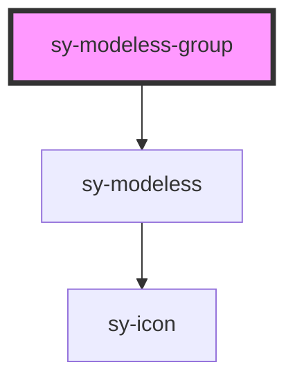

# sy-modeless-group

<!-- Auto Generated Below -->

## Methods

### `close(id: string) => Promise<void>`

#### Parameters

| Name | Type     | Description |
| ---- | -------- | ----------- |
| `id` | `string` |             |

#### Returns

Type: `Promise<void>`

### `closeAll() => Promise<void>`

#### Returns

Type: `Promise<void>`

### `create(id: string, title?: string | HTMLElement | VNode, content?: string | HTMLElement | VNode, option?: Partial<Pick<HTMLSyModelessElement, "draggable" | "resizable" | "edge" | "closable" | "maximizable" | "minimizable" | "top" | "left" | "width" | "height">>) => Promise<void>`

#### Parameters

| Name      | Type                                                                                                                                                                                            | Description |
| --------- | ----------------------------------------------------------------------------------------------------------------------------------------------------------------------------------------------- | ----------- |
| `id`      | `string`                                                                                                                                                                                        |             |
| `title`   | `string \| HTMLElement \| VNode`                                                                                                                                                                |             |
| `content` | `string \| HTMLElement \| VNode`                                                                                                                                                                |             |
| `option`  | `{ draggable?: boolean; height?: number; width?: number; top?: number; resizable?: boolean; closable?: boolean; minimizable?: boolean; maximizable?: boolean; edge?: boolean; left?: number; }` |             |

#### Returns

Type: `Promise<void>`

### `updateContent(id: string, content: string | HTMLElement | VNode) => Promise<void>`

#### Parameters

| Name      | Type                             | Description |
| --------- | -------------------------------- | ----------- |
| `id`      | `string`                         |             |
| `content` | `string \| HTMLElement \| VNode` |             |

#### Returns

Type: `Promise<void>`

### `updateOption(id: string, option: Partial<Pick<HTMLSyModelessElement, "draggable" | "resizable" | "edge" | "closable" | "maximizable" | "minimizable" | "top" | "left" | "width" | "height">>) => Promise<void>`

#### Parameters

| Name     | Type                                                                                                                                                                                            | Description |
| -------- | ----------------------------------------------------------------------------------------------------------------------------------------------------------------------------------------------- | ----------- |
| `id`     | `string`                                                                                                                                                                                        |             |
| `option` | `{ draggable?: boolean; height?: number; width?: number; top?: number; resizable?: boolean; closable?: boolean; minimizable?: boolean; maximizable?: boolean; edge?: boolean; left?: number; }` |             |

#### Returns

Type: `Promise<void>`

### `updateTitle(id: string, title: string | HTMLElement | VNode) => Promise<void>`

#### Parameters

| Name    | Type                             | Description |
| ------- | -------------------------------- | ----------- |
| `id`    | `string`                         |             |
| `title` | `string \| HTMLElement \| VNode` |             |

#### Returns

Type: `Promise<void>`

## Dependencies

### Depends on

- [sy-modeless](.)

### Graph

----------------------------------------------

*Built with [StencilJS](https://stenciljs.com/)*
