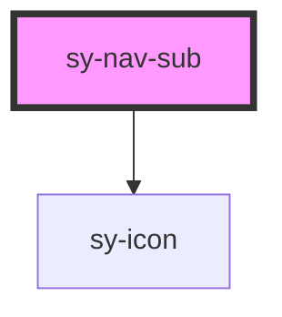

# sy-nav-sub

<!-- Auto Generated Below -->

## Overview

sy-nav-sub (Stencil port, light DOM, scoped)
- Navigation submenu component with collapsible functionality
- Supports click and hover triggers

## Properties

| Property   | Attribute  | Description | Type      | Default |
| ---------- | ---------- | ----------- | --------- | ------- |
| `depth`    | `depth`    |             | `number`  | `0`     |
| `disabled` | `disabled` |             | `boolean` | `false` |
| `open`     | `open`     |             | `boolean` | `false` |
| `title`    | `title`    |             | `string`  | `''`    |
| `value`    | `value`    |             | `string`  | `''`    |

## Methods

### `groupItem(group: boolean) => Promise<void>`

#### Parameters

| Name    | Type      | Description |
| ------- | --------- | ----------- |
| `group` | `boolean` |             |

#### Returns

Type: `Promise<void>`

### `parentDisabled(disabled: boolean) => Promise<void>`

#### Parameters

| Name       | Type      | Description |
| ---------- | --------- | ----------- |
| `disabled` | `boolean` |             |

#### Returns

Type: `Promise<void>`

### `setActive(active: boolean) => Promise<void>`

#### Parameters

| Name     | Type      | Description |
| -------- | --------- | ----------- |
| `active` | `boolean` |             |

#### Returns

Type: `Promise<void>`

### `setClose() => Promise<void>`

#### Returns

Type: `Promise<void>`

### `setOpen() => Promise<void>`

#### Returns

Type: `Promise<void>`

### `setTrigger() => Promise<void>`

#### Returns

Type: `Promise<void>`

## Dependencies

### Depends on

- [sy-icon](../icon)

### Graph

----------------------------------------------

*Built with [StencilJS](https://stenciljs.com/)*
