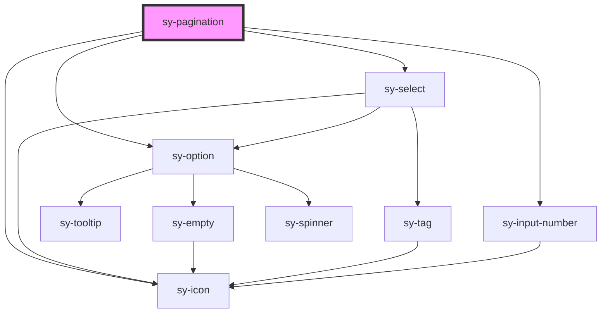

# sy-pagination

<!-- Auto Generated Below -->

## Properties

| Property          | Attribute         | Description | Type      | Default     |
| ----------------- | ----------------- | ----------- | --------- | ----------- |
| `activePage`      | `activepage`      |             | `number`  | `1`         |
| `disabled`        | `disabled`        |             | `boolean` | `false`     |
| `hideonSingle`    | `hideonsingle`    |             | `boolean` | `false`     |
| `jumper`          | `jumper`          |             | `boolean` | `false`     |
| `pageSize`        | `pagesize`        |             | `number`  | `10`        |
| `pageSizeOptions` | `pagesizeoptions` |             | `string`  | `undefined` |
| `total`           | `total`           |             | `boolean` | `false`     |
| `totalItems`      | `totalitems`      |             | `number`  | `0`         |

## Events

| Event             | Description | Type                  |
| ----------------- | ----------- | --------------------- |
| `pageChanged`     |             | `CustomEvent<number>` |
| `pageSizeChanged` |             | `CustomEvent<number>` |

## Dependencies

### Depends on

- [sy-icon](../icon)
- [sy-select](../select)
- [sy-option](../select)
- [sy-input-number](../input-number)

### Graph

----------------------------------------------

*Built with [StencilJS](https://stenciljs.com/)*
