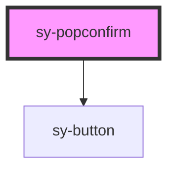

# sy-popconfirm

<!-- Auto Generated Below -->

## Properties

| Property      | Attribute     | Description | Type                                                                                                                                                             | Default    |
| ------------- | ------------- | ----------- | ---------------------------------------------------------------------------------------------------------------------------------------------------------------- | ---------- |
| `arrow`       | `arrow`       |             | `boolean`                                                                                                                                                        | `false`    |
| `cancelText`  | `canceltext`  |             | `string`                                                                                                                                                         | `'Cancel'` |
| `closable`    | `closable`    |             | `boolean`                                                                                                                                                        | `false`    |
| `closedelay`  | `closedelay`  |             | `number`                                                                                                                                                         | `0`        |
| `confirmText` | `confirmtext` |             | `string`                                                                                                                                                         | `'OK'`     |
| `opendelay`   | `opendelay`   |             | `number`                                                                                                                                                         | `0`        |
| `position`    | `position`    |             | `"bottom" \| "bottomLeft" \| "bottomRight" \| "left" \| "leftBottom" \| "leftTop" \| "right" \| "rightBottom" \| "rightTop" \| "top" \| "topLeft" \| "topRight"` | `'top'`    |
| `sticky`      | `sticky`      |             | `boolean`                                                                                                                                                        | `false`    |
| `trigger`     | `trigger`     |             | `"click" \| "none"`                                                                                                                                              | `'click'`  |

## Events

| Event            | Description | Type                            |
| ---------------- | ----------- | ------------------------------- |
| `selected`       |             | `CustomEvent<"cancel" \| "ok">` |
| `visibleChanged` |             | `CustomEvent<boolean>`          |

## Methods

### `setClose() => Promise<void>`

#### Returns

Type: `Promise<void>`

### `setOpen() => Promise<void>`

#### Returns

Type: `Promise<void>`

## Dependencies

### Depends on

- [sy-button](../button)

### Graph

----------------------------------------------

*Built with [StencilJS](https://stenciljs.com/)*
