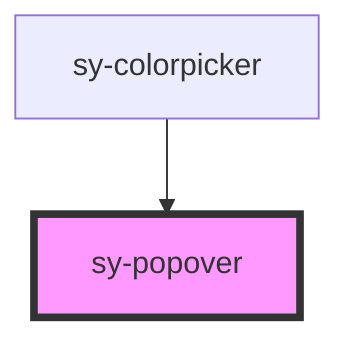

# sy-popover

<!-- Auto Generated Below -->

## Overview

팝오버 컴포넌트 - 다른 요소에 부가 정보를 표시하는 오버레이 요소
마우스 호버, 클릭, 포커스 등의 트리거로 활성화됩니다.

## Properties

| Property     | Attribute    | Description | Type                                                                                                                                                             | Default    |
| ------------ | ------------ | ----------- | ---------------------------------------------------------------------------------------------------------------------------------------------------------------- | ---------- |
| `arrow`      | `arrow`      |             | `boolean`                                                                                                                                                        | `false`    |
| `closedelay` | `closedelay` |             | `number`                                                                                                                                                         | `100`      |
| `open`       | `open`       |             | `boolean`                                                                                                                                                        | `false`    |
| `opendelay`  | `opendelay`  |             | `number`                                                                                                                                                         | `0`        |
| `position`   | `position`   |             | `"bottom" \| "bottomLeft" \| "bottomRight" \| "left" \| "leftBottom" \| "leftTop" \| "right" \| "rightBottom" \| "rightTop" \| "top" \| "topLeft" \| "topRight"` | `'bottom'` |
| `sticky`     | `sticky`     |             | `boolean`                                                                                                                                                        | `false`    |
| `trigger`    | `trigger`    |             | `"click" \| "focus" \| "hover" \| "null"`                                                                                                                        | `'hover'`  |

## Methods

### `setClose() => Promise<void>`

팝업을 닫기 위한 공개 메서드

#### Returns

Type: `Promise<void>`

### `setOpen() => Promise<void>`

팝업을 열기 위한 공개 메서드

#### Returns

Type: `Promise<void>`

## Dependencies

### Used by

 - [sy-colorpicker](../colorpicker)

### Graph

----------------------------------------------

*Built with [StencilJS](https://stenciljs.com/)*
