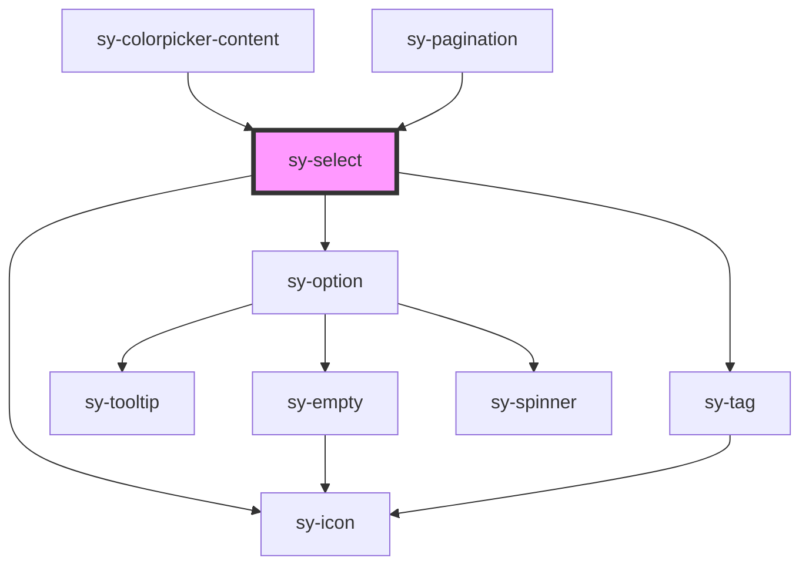

# sy-select

<!-- Auto Generated Below -->

## Properties

| Property           | Attribute          | Description | Type                                               | Default     |
| ------------------ | ------------------ | ----------- | -------------------------------------------------- | ----------- |
| `clearable`        | `clearable`        |             | `boolean`                                          | `false`     |
| `defaultValue`     | `defaultvalue`     |             | `string`                                           | `''`        |
| `disabled`         | `disabled`         |             | `boolean`                                          | `false`     |
| `empty`            | `empty`            |             | `boolean`                                          | `false`     |
| `error`            | `error`            |             | `boolean`                                          | `false`     |
| `hide`             | `hide`             |             | `boolean`                                          | `false`     |
| `loading`          | `loading`          |             | `boolean`                                          | `false`     |
| `maxTagCount`      | `maxtagcount`      |             | `number`                                           | `0`         |
| `mode`             | `mode`             |             | `"default" \| "multiple" \| "searchable" \| "tag"` | `'default'` |
| `name`             | `name`             |             | `string`                                           | `''`        |
| `noNativeValidity` | `nonativevalidity` |             | `boolean`                                          | `false`     |
| `placeholder`      | `placeholder`      |             | `string`                                           | `''`        |
| `readonly`         | `readonly`         |             | `boolean`                                          | `false`     |
| `required`         | `required`         |             | `boolean`                                          | `false`     |
| `size`             | `size`             |             | `"large" \| "medium" \| "small"`                   | `'medium'`  |

## Events

| Event          | Description | Type                  |
| -------------- | ----------- | --------------------- |
| `blured`       |             | `CustomEvent<void>`   |
| `cleared`      |             | `CustomEvent<void>`   |
| `focused`      |             | `CustomEvent<void>`   |
| `inputChanged` |             | `CustomEvent<string>` |
| `opened`       |             | `CustomEvent<void>`   |
| `removed`      |             | `CustomEvent<any>`    |
| `selected`     |             | `CustomEvent<any>`    |

## Methods

### `checkValidity() => Promise<boolean>`

#### Returns

Type: `Promise<boolean>`

### `clearCustomError() => Promise<void>`

#### Returns

Type: `Promise<void>`

### `clearValue() => Promise<void>`

#### Returns

Type: `Promise<void>`

### `reportValidity() => Promise<boolean>`

#### Returns

Type: `Promise<boolean>`

### `setCustomError() => Promise<void>`

#### Returns

Type: `Promise<void>`

### `setValue(values: string[] | string) => Promise<void>`

#### Parameters

| Name     | Type                 | Description |
| -------- | -------------------- | ----------- |
| `values` | `string \| string[]` |             |

#### Returns

Type: `Promise<void>`

## Dependencies

### Used by

 - [sy-colorpicker-content](../colorpicker)
 - [sy-pagination](../pagination)

### Depends on

- [sy-option](.)
- [sy-tag](../tag)
- [sy-icon](../icon)

### Graph

----------------------------------------------

*Built with [StencilJS](https://stenciljs.com/)*
