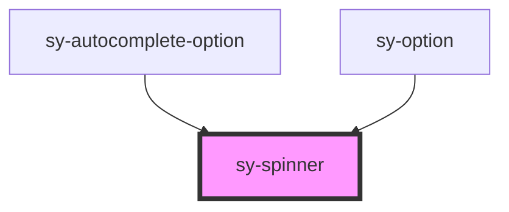

# sy-spinner

<!-- Auto Generated Below -->

## Properties

| Property      | Attribute     | Description | Type                                         | Default    |
| ------------- | ------------- | ----------- | -------------------------------------------- | ---------- |
| `delay`       | `delay`       |             | `number`                                     | `0`        |
| `description` | `description` |             | `string`                                     | `''`       |
| `hidden`      | `hidden`      |             | `boolean`                                    | `false`    |
| `inline`      | `inline`      |             | `boolean`                                    | `false`    |
| `size`        | `size`        |             | `"large" \| "medium" \| "small" \| "xlarge"` | `'medium'` |

## Dependencies

### Used by

 - [sy-autocomplete-option](../autocomplete)
 - [sy-option](../select)

### Graph

----------------------------------------------

*Built with [StencilJS](https://stenciljs.com/)*
