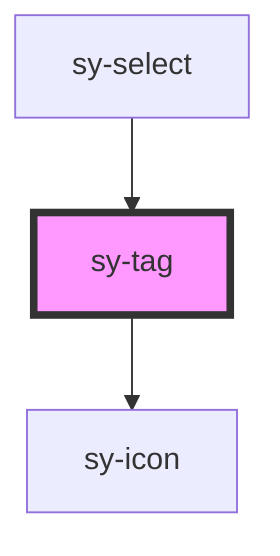

# sy-tag

<!-- Auto Generated Below -->

## Properties

| Property     | Attribute    | Description | Type                                                                                 | Default    |
| ------------ | ------------ | ----------- | ------------------------------------------------------------------------------------ | ---------- |
| `disabled`   | `disabled`   |             | `boolean`                                                                            | `false`    |
| `readonly`   | `readonly`   |             | `boolean`                                                                            | `false`    |
| `removable`  | `removable`  |             | `boolean`                                                                            | `false`    |
| `rounded`    | `rounded`    |             | `boolean`                                                                            | `false`    |
| `selectable` | `selectable` |             | `boolean`                                                                            | `false`    |
| `size`       | `size`       |             | `"large" \| "medium" \| "small"`                                                     | `'medium'` |
| `variant`    | `variant`    |             | `"blue" \| "cyan" \| "gray" \| "green" \| "orange" \| "purple" \| "red" \| "yellow"` | `'gray'`   |

## Events

| Event      | Description | Type                                      |
| ---------- | ----------- | ----------------------------------------- |
| `removed`  |             | `CustomEvent<{ tag: HTMLSyTagElement; }>` |
| `selected` |             | `CustomEvent<{ tag: HTMLSyTagElement; }>` |

## Dependencies

### Used by

 - [sy-select](../select)

### Depends on

- [sy-icon](../icon)

### Graph

----------------------------------------------

*Built with [StencilJS](https://stenciljs.com/)*
