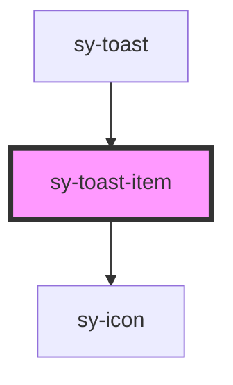

# sy-toast-item

<!-- Auto Generated Below -->

## Properties

| Property    | Attribute   | Description | Type                                                       | Default         |
| ----------- | ----------- | ----------- | ---------------------------------------------------------- | --------------- |
| `closable`  | `closable`  |             | `boolean`                                                  | `false`         |
| `duration`  | `duration`  |             | `number`                                                   | `undefined`     |
| `latestTop` | `latesttop` |             | `boolean`                                                  | `false`         |
| `open`      | `open`      |             | `boolean`                                                  | `false`         |
| `position`  | `position`  |             | `"bottomLeft" \| "bottomRight" \| "topLeft" \| "topRight"` | `'bottomRight'` |
| `variant`   | `variant`   |             | `"error" \| "info" \| "neutral" \| "success" \| "warning"` | `'neutral'`     |

## Methods

### `close() => Promise<void>`

#### Returns

Type: `Promise<void>`

### `show() => Promise<void>`

#### Returns

Type: `Promise<void>`

## Dependencies

### Used by

 - [sy-toast](.)

### Depends on

- [sy-icon](../icon)

### Graph

----------------------------------------------

*Built with [StencilJS](https://stenciljs.com/)*
