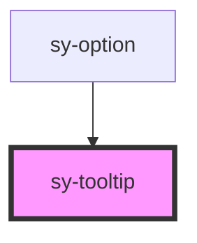

# sy-tooltip

<!-- Auto Generated Below -->

## Properties

| Property     | Attribute    | Description                                                                                                                                                                                               | Type                                                                                                                                                             | Default   |
| ------------ | ------------ | --------------------------------------------------------------------------------------------------------------------------------------------------------------------------------------------------------- | ---------------------------------------------------------------------------------------------------------------------------------------------------------------- | --------- |
| `closedelay` | `closedelay` | Delay in milliseconds before closing the tooltip after trigger event ends                                                                                                                                 | `number`                                                                                                                                                         | `0`       |
| `content`    | `content`    | The content text to display inside the tooltip                                                                                                                                                            | `string`                                                                                                                                                         | `''`      |
| `hideArrow`  | `hidearrow`  | Controls whether the tooltip arrow is hidden                                                                                                                                                              | `boolean`                                                                                                                                                        | `false`   |
| `maxWidth`   | `maxwidth`   | Maximum width of the tooltip in pixels                                                                                                                                                                    | `number`                                                                                                                                                         | `null`    |
| `open`       | `open`       | Controls whether the tooltip is currently open/visible                                                                                                                                                    | `boolean`                                                                                                                                                        | `false`   |
| `opendelay`  | `opendelay`  | Delay in milliseconds before opening the tooltip after trigger event starts                                                                                                                               | `number`                                                                                                                                                         | `0`       |
| `position`   | `position`   | Position of the tooltip relative to the trigger element Options: 'top', 'topLeft', 'topRight', 'right', 'rightTop', 'rightBottom', 'bottom', 'bottomLeft', 'bottomRight', 'left', 'leftTop', 'leftBottom' | `"bottom" \| "bottomLeft" \| "bottomRight" \| "left" \| "leftBottom" \| "leftTop" \| "right" \| "rightBottom" \| "rightTop" \| "top" \| "topLeft" \| "topRight"` | `'top'`   |
| `trigger`    | `trigger`    | Event that triggers the tooltip to show Options: 'hover', 'click', 'focus', 'none'                                                                                                                        | `"click" \| "focus" \| "hover" \| "none"`                                                                                                                        | `'hover'` |

## Methods

### `close() => Promise<void>`

#### Returns

Type: `Promise<void>`

## Dependencies

### Used by

 - [sy-option](../select)

### Graph

----------------------------------------------

*Built with [StencilJS](https://stenciljs.com/)*
